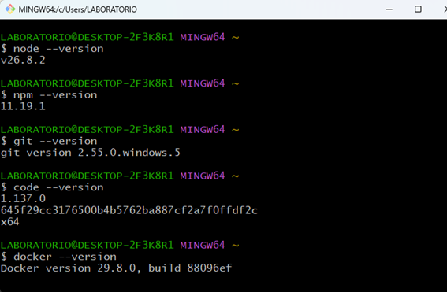
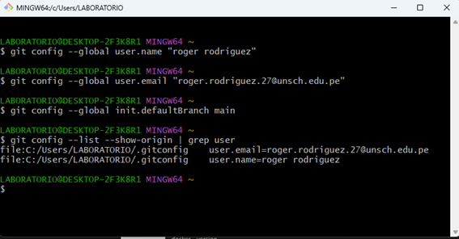

Roger Eduardo Rodriguez Delgadillo
Curso: Arquitectura de Software
Docente: Ing. Lizbeth Jaico Quispe

Descripcion del curso
Este curso transforma a desarrolladores en tomadores de decisiones estratégicas, enseñándoles a diseñar sistemas de software robustos, escalables y seguros. A través del estudio de patrones arquitectónicos modernos, despliegue en la nube y metodologías de documentación visual, aprendiendo a traducir las necesidades complejas del negocio en soluciones técnicas eficientes, dominando el arte de equilibrar rendimiento, costo y tiempo de desarrollo.

Expectativas del curso 
Comenzar a enfocarnos únicamente en la implementación a nivel de código para desarrollar una visión holística de cómo interactúan los sistemas a gran escala.Mejorar en la comunicación técnica cómo documentar y justificar tus decisiones utilizando estándares de la industria (Modelo C4, ADRs) para alinear tanto a equipos de desarrollo como a perfiles de negocio no técnicos.

Paso 1 (Verificar versiones)

PAso 2 (Configurar tu identidad en Git)
